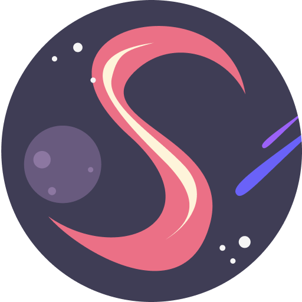

# spacestagram

<p align="center">
    <a href="https://armiantos-spacetagram.netlify.app/">
        
    </a>
</p>

Share your business' host star cluster with your friends across the galaxies! View the site at [https://armiantos-spacetagram.netlify.app/](https://armiantos-spacetagram.netlify.app/).

This app uses [NASA's Astronomy Picture of the Day API](https://api.nasa.gov/#apod)
to let merchants browse through the observable universe to get more information on
where they should expand next.

## Requirements

-   node (14.17.1)
-   npm (8.2.0)

## Getting started

1. Install dependencies

    ```sh
    npm install
    ```

2. Serve the client web server on port 3000

    ```sh
    npm start
    ```

## Features

-   Favorites are saved in the user's browser
-   Infinite scrolling homepage (auto fetches new images as you scroll down)
-   Image cards can be clicked to get more information about the object in the image
